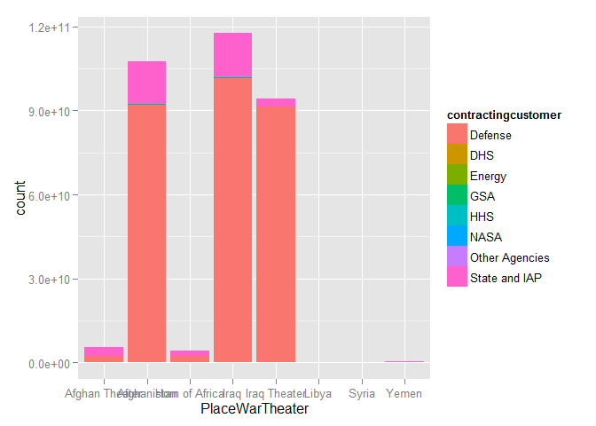
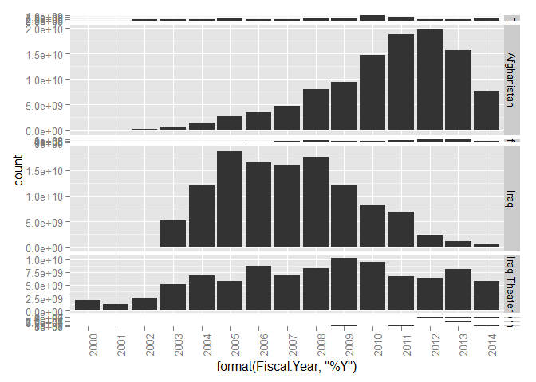
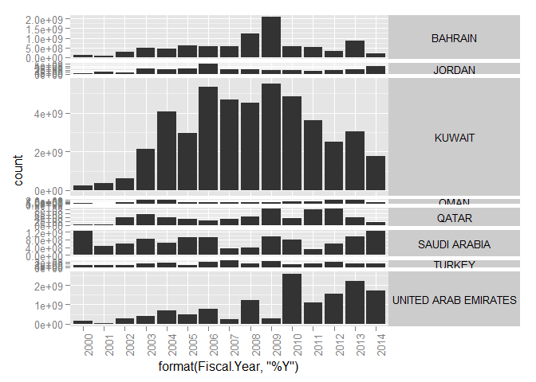
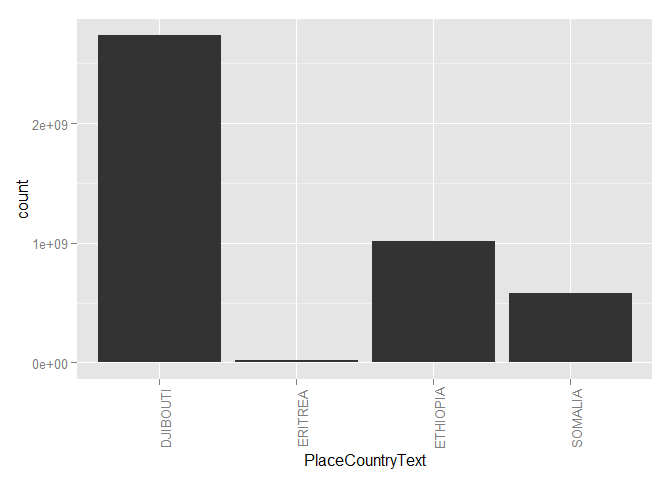
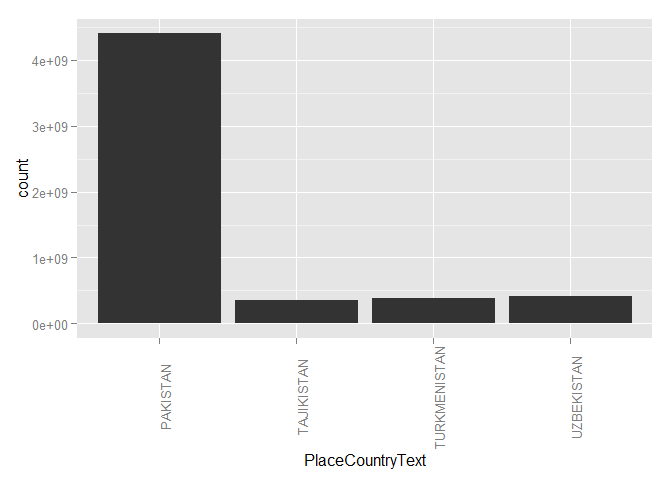
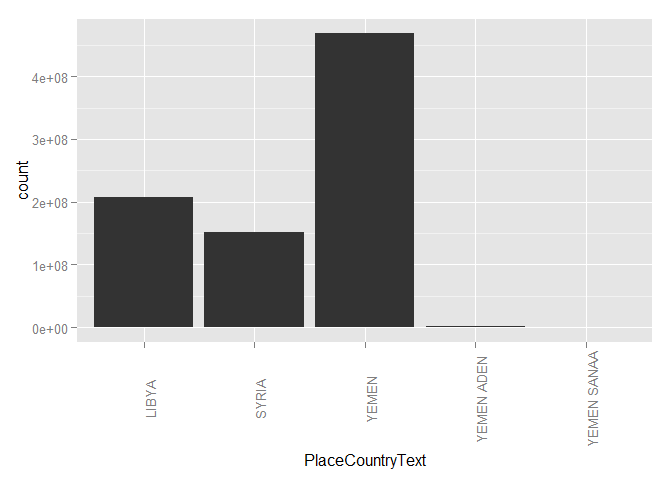

# DoD Fixed-Price Study: Contract Duration Classification
Greg Sanders  
Tuesday, January 13, 2015  


```
## Loading required package: ggplot2
## Loading required package: stringr
## Loading required package: plyr
## Loading required package: Hmisc
## Loading required package: grid
## Loading required package: lattice
## Loading required package: survival
## Loading required package: splines
## Loading required package: Formula
## 
## Attaching package: 'Hmisc'
## 
## The following objects are masked from 'package:plyr':
## 
##     is.discrete, summarize
## 
## The following objects are masked from 'package:base':
## 
##     format.pval, round.POSIXt, trunc.POSIXt, units
## 
## Loading required package: scales
```

Contracts are classified using a mix of numerical and categorical variables. While the changes in numerical variables are easy to grasp and summarize, a contract may have one line item that is competed and another that is not. As is detailed in the [exploration on R&D](RnD_1to5_exploration.md), we are only considering information available prior to contract start. The percentage of contract obligations that were competed is a valuable benchmark, but is highly influenced by factors that occured after contract start..

##Studying contract duration within the sample.
Initial contract duration is a new characteristic for CSIS.  The duration is calculated by comparing the earliest *effective date* to *current completion date.*  The current date was used rather than the *ultimate complete date* because the later is often unlabeled.  

##Methodological Notes on Contract Period of Performance

*Signed date* of the unmodified contract is used as a criteria for inclusion because the fiscal year used for reporting, and thus presumably certification, is based on *signed date* and not *effective date*.  CSIS may refine this methodology based on consultation with experts and further study of that data.  For greater transparency, considered alternatives have been listed with each period of performance value below: 

**The contract start date** is the earliest *effective date* reported under the contract.
* Alternatives include using *signed date* or using the unmodified contract values rather than the earliest values throughout the contract.

**The contract end date** is the *current completion date* of the most recently signed contract modification.
* *Ultimate completion date* is one alternative and is based on the theoretical maximum period of performance if all options were exercised.
* *Last date to order* is only available for indefinite delivery vehicles and refers to the start and not the end date of a delivery order, but it is another possible alternative.
* Finally, the modification with the most recent *signed date* could be replaced by the modification with the most recent *effect date* or instead the dates furthest in the future could be chosen.  

**Completed contracts** have a contract end date in FY2013 or have been marked as closed and/or terminated. 


```r
# AllTheater  <- read.csv(
#     paste("data\\FPDSwarTheater.txt", sep = ""),
#     header = TRUE, sep = "\t", dec = ".", strip.white = TRUE, 
#     na.strings = c("NULL","NA",""),
#     stringsAsFactors = TRUE
#     )

AllTheater  <- read.csv(
    paste("data\\Location_SP_WarTheaterHistoryBucketSubCustomer.csv", sep = ""),
    header = TRUE, sep = ",", dec = ".", strip.white = TRUE, 
    na.strings = c("NULL","NA",""),
    stringsAsFactors = TRUE
    )


colnames(AllTheater)[colnames(AllTheater)=="ï..fiscal_year"]<-"Fiscal.Year"
#These will probably be moved into apply_lookups at some point
AllTheater<-apply_lookups(Path,AllTheater)
```

```
## Joining by: Fiscal.Year
```

```r
AllTheater<-subset(AllTheater,Fiscal.Year>=2000)
WarTheater<-subset(AllTheater,!is.na(PlaceWarTheater))

summary(subset(WarTheater,
               select=c(Fiscal.Year,
      contractingcustomer,
      contractingsubcustomer,
      PlaceWarTheater,
      PlaceCountryText,
      ConstantOligatedAmount
                                ))
        )
```

```
##   Fiscal.Year             contractingcustomer contractingsubcustomer
##  Min.   :2000-09-30   Defense       :3618     Army     :1264        
##  1st Qu.:2007-09-30   State and IAP :1650     State    :1203        
##  Median :2010-09-30   Other Agencies: 467     Navy     : 871        
##  Mean   :2010-06-30   GSA           :  90     DLA      : 555        
##  3rd Qu.:2013-09-30   DHS           :  88     Air Force: 521        
##  Max.   :2014-09-30   HHS           :  52     (Other)  :1545        
##                       (Other)       :  15     NA's     :  21        
##        PlaceWarTheater             PlaceCountryText ConstantOligatedAmount
##  Iraq Theater  :3157   AFGHANISTAN         : 754    Min.   :-1.654e+08    
##  Afghanistan   : 754   KUWAIT              : 624    1st Qu.: 2.876e+04    
##  Afghan Theater: 735   IRAQ                : 547    Median : 3.506e+05    
##  Horn of Africa: 606   BAHRAIN             : 484    Mean   : 5.522e+07    
##  Iraq          : 547   UNITED ARAB EMIRATES: 484    3rd Qu.: 5.307e+06    
##  Yemen         : 106   TURKEY              : 462    Max.   : 1.471e+10    
##  (Other)       :  75   (Other)             :2625
```

```r
ggplot(
    data = WarTheater,
    aes_string(x = "PlaceWarTheater",
               weight = "ConstantOligatedAmount",
               fill="contractingcustomer")
    ) +     geom_bar()
```

 

```r
#+scale_x_continuous(limits=c(0, 2000))


ggplot(
    data = WarTheater,
    aes_string(x = "format(Fiscal.Year,'%Y')",
               weight = "ConstantOligatedAmount")
    ) +     geom_bar()+theme(axis.text.x=element_text(angle=90))+facet_grid(PlaceWarTheater ~., scales="free_y", space="free_y")
```

 

```r
    #scale_x_date(breaks = date_breaks("years"),  labels = date_format("%y"))

WarTheaterSummary<-aggregate(WarTheater$ConstantOligatedAmount
                            , by=list(WarTheater$Fiscal.Year,WarTheater$PlaceWarTheater)
                            ,FUN = "sum"
                            ,na.rm =TRUE
    )
    names(WarTheaterSummary)<-c(
      
      "Fiscal.Year"
          ,"WarTheater"
      ,"ConstantOligatedAmount"
    )

WarCountrySummary<-aggregate(WarTheater$ConstantOligatedAmount
                            , by=list(WarTheater$Fiscal.Year,
                                      WarTheater$PlaceWarTheater,
                                      WarTheater$PlaceCountryText)
                            ,FUN = "sum"
                            ,na.rm =TRUE
    )
    names(WarCountrySummary)<-c(
        "WarTheater"
     ,"Country"   
      ,"Fiscal.Year"
      ,"ConstantOligatedAmount"
    )


View(WarCountrySummary)
    
ggplot(
    data = subset(WarTheater,PlaceWarTheater=="Iraq Theater"),
    aes_string(x = "format(Fiscal.Year,'%Y')",
               weight = "ConstantOligatedAmount")
    ) +     geom_bar()+theme(axis.text.x=element_text(angle=90))+facet_grid(PlaceCountryText ~., scales="free_y", space="free_y")+theme(strip.text.y=element_text(angle=0))
```

 

```r
    #scale_x_date(breaks = date_breaks("years"),  labels = date_format("%y"))


ggplot(
    data = subset(WarTheater,PlaceWarTheater=="Horn of Africa"),
    aes_string(x = "PlaceCountryText",
               weight = "ConstantOligatedAmount")
    ) +     geom_bar()+theme(axis.text.x=element_text(angle=90))
```

 

```r
ggplot(
    data = subset(WarTheater,PlaceWarTheater=="Afghan Theater"),
    aes_string(x = "PlaceCountryText",
               weight = "ConstantOligatedAmount")
    ) +     geom_bar()+theme(axis.text.x=element_text(angle=90))
```

 

```r
ggplot(
    data = subset(WarTheater,!PlaceWarTheater %in% c("Horn of Africa","Iraq Theater","Afghan Theater","Iraq","Afghanistan")),
    aes_string(x = "PlaceCountryText",
               weight = "ConstantOligatedAmount")
    ) +     geom_bar()+theme(axis.text.x=element_text(angle=90))
```

 

```r
#+facet_wrap(~PlaceWarTheater)
```


